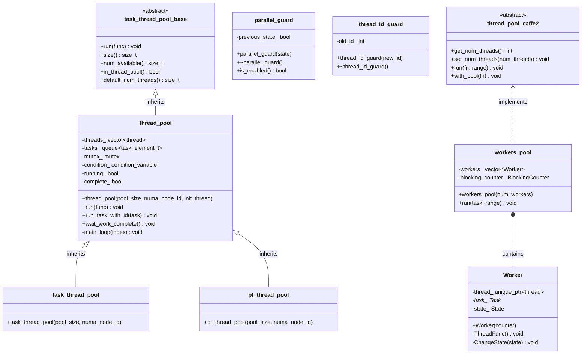

# XSigma Parallel Execution Framework - Class Hierarchy

## Overview

The `` module provides a comprehensive parallel execution framework for XSigma, supporting multiple threading backends (Native std::thread, OpenMP) with a unified API. The framework enables both intra-op parallelism (within a single operation) and inter-op parallelism (across multiple operations).

**Key Features:**
- Multiple backend support (Native thread pool, OpenMP)
- Thread pool registry pattern for extensibility
- RAII-based thread safety guards
- Future/promise abstractions for async operations
- NUMA-aware thread affinity
- Configurable grain size for work distribution

---

## Class Hierarchy Diagram



---

## Core Classes

### 1. `task_thread_pool_base` (Abstract Base Class)

**Purpose:** Abstract interface for all thread pool implementations.

**Location:** `thread_pool.h`

**Key Methods:**
- `virtual void run(std::function<void()> func) = 0` - Execute a task asynchronously
- `virtual size_t size() const = 0` - Get number of threads in pool
- `virtual size_t num_available() const = 0` - Get number of idle threads
- `virtual bool in_thread_pool() const = 0` - Check if current thread is from pool
- `static size_t default_num_threads()` - Get default thread count

**Thread Safety:** All methods are thread-safe.

**Usage Example:**
```cpp
xsigma::task_thread_pool_base& pool = get_thread_pool();
pool.run([]() { /* task code */ });
```

---

### 2. `thread_pool` (Concrete Implementation)

**Purpose:** Native std::thread-based thread pool with work queue.

**Location:** `thread_pool.h`, `thread_pool.cxx`

**Base Class:** `task_thread_pool_base`

**Key Members:**
- `std::vector<std::thread> threads_` - Worker threads
- `std::queue<task_element_t> tasks_` - Task queue
- `std::mutex mutex_` - Protects task queue
- `std::condition_variable condition_` - Signals new tasks
- `bool running_` - Pool is active
- `bool complete_` - All tasks completed

**Key Methods:**
- `thread_pool(int pool_size, int numa_node_id, const std::function<void()>& init_thread)`
- `void run(std::function<void()> func)` - Queue a task
- `void wait_work_complete()` - Block until all tasks complete
- `void main_loop(std::size_t index)` - Worker thread entry point (private)

**Thread Safety:** Fully thread-safe. Uses mutex and condition variables.

**NUMA Support:** Can bind threads to specific NUMA nodes via `numa_node_id` parameter.

---

### 3. `task_thread_pool` (Specialized Thread Pool)

**Purpose:** Thread pool for Caffe2-style task execution with NUMA binding.

**Location:** `thread_pool.h`

**Base Class:** `thread_pool`

**Initialization:** Sets thread name to "CaffeTaskThread" and binds to NUMA node.

**Usage:**
```cpp
xsigma::task_thread_pool pool(4, 0);  // 4 threads on NUMA node 0
pool.run([]() { /* task */ });
```

---

### 4. `pt_thread_pool` (PyTorch-Style Thread Pool)

**Purpose:** Thread pool matching PyTorch's threading semantics.

**Location:** `thread_pool.h`

**Base Class:** `thread_pool`

**Initialization:** Sets thread name to "thread_pool" and calls `init_num_threads()`.

**Usage:**
```cpp
xsigma::pt_thread_pool pool(8);  // 8 threads
pool.run([]() { /* task */ });
```

---

## RAII Guards

### 5. `parallel_guard`

**Purpose:** RAII guard tracking whether code executes in parallel region.

**Location:** `ParallelGuard.h`

**Key Methods:**
- `parallel_guard(bool state)` - Constructor sets parallel state
- `~parallel_guard()` - Destructor restores previous state
- `static bool is_enabled()` - Check if in parallel region

**Thread Safety:** Thread-local state, safe for concurrent use.

**Usage:**
```cpp
{
    xsigma::parallel_guard guard(true);
    // Code here is marked as "in parallel region"
}  // Automatically restored on scope exit
```

---

### 6. `thread_id_guard`

**Purpose:** RAII guard for temporarily changing thread ID.

**Location:** `Parallel.h`

**Key Methods:**
- `thread_id_guard(int new_id)` - Set new thread ID
- `~thread_id_guard()` - Restore old thread ID

**Usage:**
```cpp
{
    xsigma::internal::thread_id_guard guard(5);
    // Current thread ID is 5
}  // Restored to previous ID
```

---

## Thread Pool Registry

### 7. `ThreadPoolRegistry`

**Purpose:** Factory registry for creating thread pools by name.

**Location:** `thread_pool.h`, `thread_pool.cxx`

**Type:** `XSIGMA_DECLARE_SHARED_REGISTRY(ThreadPoolRegistry, task_thread_pool_base, int, int, bool)`

**Registration:**
```cpp
XSIGMA_REGISTER_CREATOR(ThreadPoolRegistry, C10, create_c10_threadpool)
```

**Usage:**
```cpp
auto pool = ThreadPoolRegistry()->Create("C10", device_id, pool_size, create_new);
```

---

## Legacy Caffe2 Classes

### 8. `thread_pool` (Caffe2 Legacy)

**Purpose:** Legacy Caffe2 thread pool interface (different from xsigma::thread_pool).

**Location:** `ThreadPool.h`

**Namespace:** `caffe2`

**Note:** This is a legacy interface maintained for backward compatibility. New code should use `xsigma::thread_pool`.

---

### 9. `workers_pool`

**Purpose:** Work-stealing thread pool based on gemmlowp design.

**Location:** `WorkersPool.h`

**Namespace:** `caffe2`

**Key Features:**
- Work-stealing for load balancing
- Cache-line aligned workers
- Blocking counter for synchronization

**Components:**
- `Worker` - Individual worker thread
- `BlockingCounter` - Synchronization primitive
- `Task` - Work item

---

## Module Organization

### File Structure

```
Library/Core//
├── Parallel.h                    # Main API header
├── Parallel-inl.h                # Template implementations (parallel_for, parallel_reduce)
├── ParallelNative.h/.cxx         # Native backend implementation
├── ParallelOpenMP.h/.cxx         # OpenMP backend implementation
├── ParallelCommon.cxx            # Shared utilities
├── thread_pool.h              # Future/promise abstractions
├── ParallelGuard.h               # RAII guards
├── thread_pool.h                # PyTorch-style thread pool
├── thread_pool.h/.cxx            # Core thread pool implementation
├── ThreadPool.h/.cxx             # Legacy Caffe2 thread pool
├── WorkersPool.h                 # Work-stealing pool
├── ThreadLocalState.h            # Thread-local state management
├── thread_pool_guard.h/.cxx      # Thread pool guards
└── pthreadpool.h/.cxx            # Legacy pthreadpool compatibility
```

---

## Key Abstractions

### Parallel Execution Primitives

**1. `parallel_for`** (Template in `Parallel-inl.h`)
```cpp
template <class F>
void parallel_for(int64_t begin, int64_t end, int64_t grain_size, const F& f);
```
- Executes function `f` over range `[begin, end)` in parallel
- `grain_size` controls minimum work per thread
- Automatically uses thread pool if beneficial

**2. `parallel_reduce`** (Template in `Parallel-inl.h`)
```cpp
template <class scalar_t, class F, class SF>
scalar_t parallel_reduce(int64_t begin, int64_t end, int64_t grain_size,
                         scalar_t ident, const F& f, const SF& sf);
```
- Parallel reduction over range with identity value
- `f` computes partial results, `sf` combines them
- Returns final reduced value

**3. `invoke_parallel`** (Internal)
```cpp
void invoke_parallel(int64_t begin, int64_t end, int64_t grain_size,
                     const std::function<void(int64_t, int64_t)>& f);
```
- Low-level parallel invocation
- Handles task distribution and synchronization
- Backend-specific implementations (Native vs OpenMP)

---

## API Functions

### Thread Management
- `void init_num_threads()` - Initialize threading subsystem
- `void set_num_threads(int nthreads)` - Set intra-op thread count
- `int get_num_threads()` - Get current thread count
- `int get_thread_num()` - Get current thread ID (0-based)
- `bool in_parallel_region()` - Check if in parallel region

### Inter-Op Parallelism
- `void set_num_interop_threads(int nthreads)` - Set inter-op threads
- `size_t get_num_interop_threads()` - Get inter-op thread count
- `void launch(std::function<void()> func)` - Launch inter-op task

### Intra-Op Parallelism
- `void intraop_launch(const std::function<void()>& func)` - Launch intra-op task
- `int intraop_default_num_threads()` - Get default intra-op threads

### Information
- `std::string get_parallel_info()` - Get parallelization settings

---

## Dependencies

### Internal Module Dependencies
```
Parallel.h
  ├─> ParallelNative.h (if AT_PARALLEL_NATIVE)
  ├─> ParallelOpenMP.h (if AT_PARALLEL_OPENMP)
  └─> Parallel-inl.h

thread_pool.h
  ├─> smp/Advanced/thread_name.h
  ├─> util/numa.h
  └─> util/registry.h

thread_pool.h
  ├─> thread_pool.h
  └─> Parallel.h
```

### External Dependencies
- `smp/Advanced/thread_name.h` - Thread naming utilities
- `util/numa.h` - NUMA binding
- `util/registry.h` - Registry pattern
- `util/irange.h` - Range iteration
- `logging/logger.h` - Logging
- `common/export.h` - DLL export macros

---

## Thread Safety Guarantees

| Class/Function | Thread Safety | Notes |
|----------------|---------------|-------|
| `task_thread_pool_base` | Thread-safe | All methods can be called concurrently |
| `thread_pool` | Thread-safe | Mutex-protected task queue |
| `parallel_guard` | Thread-safe | Thread-local state |
| `thread_id_guard` | Thread-safe | Thread-local state |
| `parallel_for` | Thread-safe | Can be called from multiple threads |
| `parallel_reduce` | Thread-safe | Can be called from multiple threads |
| `set_num_threads` | Thread-safe | Atomic operations |
| `get_num_threads` | Thread-safe | Atomic reads |

---

## Backend Selection

The framework supports multiple backends selected at compile time:

**Native Backend** (`AT_PARALLEL_NATIVE`):
- Uses `std::thread` and custom thread pool
- Full control over thread lifecycle
- Supports NUMA affinity
- Implementation: `ParallelNative.cxx`

**OpenMP Backend** (`AT_PARALLEL_OPENMP`):
- Uses OpenMP directives (`#pragma omp`)
- Integrates with MKL
- Compiler-managed thread pool
- Implementation: `ParallelOpenMP.cxx`

---

## Usage Examples

### Basic Parallel For Loop
```cpp
#include "Parallel.h"

// Process array in parallel
std::vector<int> data(1000000);
xsigma::parallel_for(0, data.size(), 1000, [&](int64_t begin, int64_t end) {
    for (int64_t i = begin; i < end; ++i) {
        data[i] = process(data[i]);
    }
});
```

### Parallel Reduction
```cpp
// Sum array in parallel
std::vector<double> values(1000000);
double sum = xsigma::parallel_reduce(
    0, values.size(), 1000,
    0.0,  // identity
    [&](int64_t begin, int64_t end, double init) {
        double partial = init;
        for (int64_t i = begin; i < end; ++i) {
            partial += values[i];
        }
        return partial;
    },
    std::plus<double>()  // combine function
);
```

### Custom Thread Pool
```cpp
// Create custom thread pool
xsigma::pt_thread_pool pool(8, 0);  // 8 threads on NUMA node 0

// Execute tasks
pool.run([]() { task1(); });
pool.run([]() { task2(); });
pool.wait_work_complete();
```

---

**Document Version:** 1.0
**Last Updated:** 2025-11-04
**Maintainer:** XSigma Development Team
