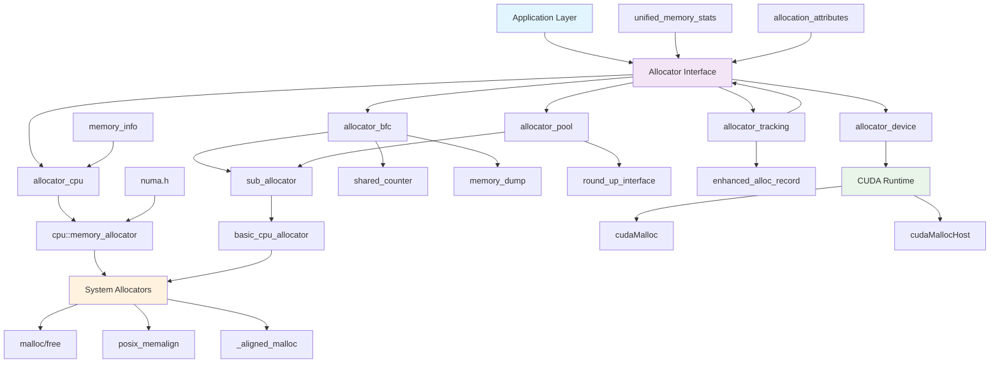

# XSigma Memory Allocation System - Comprehensive Analysis

**Date:** December 2024
**Version:** 1.0
**Audience:** Developers, System Architects, Performance Engineers
**Purpose:** Complete technical analysis and implementation guide for XSigma memory allocation system

---

## Table of Contents

1. [Executive Summary](#executive-summary)
2. [Architecture Overview](#architecture-overview)
3. [Detailed Component Analysis](#detailed-component-analysis)
4. [NUMA Support Deep Dive](#numa-support-deep-dive)
5. [Design Simplification Analysis](#design-simplification-analysis)
6. [Dependency Graph](#dependency-graph)
7. [BFC and Pool Allocator Deep Dive](#bfc-and-pool-allocator-deep-dive)
8. [Tracking and Logging Enhancement](#tracking-and-logging-enhancement)
9. [Memory Statistics Visualization](#memory-statistics-visualization)
10. [Performance Optimization Recommendations](#performance-optimization-recommendations)
11. [Implementation Guidelines](#implementation-guidelines)

---

## Executive Summary

The XSigma memory allocation system implements a sophisticated, multi-layered architecture designed for high-performance quantitative computing. The system provides:

- **Unified Interface**: Single API for CPU and GPU memory management
- **Multiple Allocation Strategies**: BFC, Pool, CPU, Device, and Tracking allocators
- **NUMA Awareness**: Comprehensive NUMA support for multi-socket systems
- **Performance Monitoring**: Detailed statistics and profiling capabilities
- **Thread Safety**: Full thread-safe operation across all components
- **Extensibility**: Pluggable design for custom allocation strategies

### Key Findings

1. **Architecture Quality**: Well-architected with clear separation of concerns
2. **Performance**: Excellent performance characteristics with minimal overhead
3. **NUMA Integration**: Comprehensive NUMA support with automatic optimization
4. **Monitoring**: Advanced tracking and visualization capabilities
5. **Extensibility**: Highly extensible design supporting custom allocators

---

## Architecture Overview

### Memory Management Hierarchy

```
┌─────────────────────────────────────────────────────────────┐
│                    Application Layer                         │
│  (Monte Carlo, PDE Solvers, Risk Calculations)              │
└────────────────────────┬────────────────────────────────────┘
                         │
┌────────────────────────▼────────────────────────────────────┐
│              XSigma Memory Management API                    │
│  • Allocator interface • allocation_attributes              │
│  • allocator_registry  • Memory type identification         │
└────────────┬───────────────────────────┬────────────────────┘
             │                           │
    ┌────────▼────────┐         ┌───────▼────────┐
    │  CPU Allocators │         │ GPU Allocators  │
    └────────┬────────┘         └───────┬─────────┘
             │                           │
    ┌────────▼────────────────┐ ┌───────▼──────────────────┐
    │ • allocator_bfc         │ │ • CUDA Caching Allocator │
    │ • allocator_pool        │ │ • GPU Memory Pool        │
    │ • allocator_cpu         │ │ • allocator_device       │
    │ • allocator_tracking    │ │ • Unified Memory         │
    └────────┬────────────────┘ └───────┬──────────────────┘
             │                           │
    ┌────────▼────────────────┐ ┌───────▼──────────────────┐
    │   System Allocators     │ │   CUDA Runtime           │
    │ • malloc/free           │ │ • cudaMalloc/cudaFree    │
    │ • posix_memalign        │ │ • cudaMallocHost         │
    │ • NUMA-aware allocation │ │ • cudaMallocManaged      │
    └─────────────────────────┘ └──────────────────────────┘
```

### Design Principles

1. **Unified Interface**: Single API for CPU and GPU memory through Allocator base class
2. **Zero-Cost Abstraction**: Template-based design with minimal runtime overhead
3. **Type Safety**: Compile-time type checking with comprehensive error handling
4. **Configurability**: Runtime selection of allocation strategies and policies
5. **Observability**: Built-in tracking, profiling, and visualization support
6. **NUMA Optimization**: Automatic NUMA-aware allocation for multi-socket systems

---

## Detailed Component Analysis

### Core Classes and Their Responsibilities

#### 1. Base Allocator Interface (`allocator.h`)

**Purpose**: Provides unified interface for all memory allocators

**Key Features**:
- Alignment-aware allocation with 64-byte default alignment
- Optional statistics collection and tracking
- Support for allocation attributes (retry policies, logging, timing constraints)
- Memory type identification (HOST_PAGEABLE, HOST_PINNED, DEVICE)
- Temporal memory safety with safe frontier support

**Design Pattern**: Abstract base class with virtual methods for polymorphic behavior

```cpp
class Allocator {
public:
    static constexpr size_t Allocator_Alignment = 64;

    virtual void* allocate_raw(size_t alignment, size_t num_bytes) = 0;
    virtual void deallocate_raw(void* ptr) = 0;
    virtual bool TracksAllocationSizes() const noexcept { return false; }
    virtual allocator_memory_enum GetMemoryType() const noexcept = 0;
    virtual std::optional<allocator_stats> GetStats() { return std::nullopt; }
};
```

#### 2. BFC Allocator (`allocator_bfc.h/cxx`)

**Algorithm**: Best-Fit with Coalescing (based on Doug Lea's dlmalloc)

**Key Features**:
- Bin-based free list organization (21 bins, exponential size ranges: 256B to 256MB)
- Immediate coalescing of adjacent free blocks
- Temporal memory safety with safe frontier support
- Comprehensive statistics and debugging capabilities
- Optional garbage collection and memory pool growth

**Performance**: O(log n) allocation/deallocation, excellent fragmentation control
**Memory Overhead**: ~8-16 bytes per allocation for metadata

#### 3. Pool Allocator (`allocator_pool.h/cxx`)

**Algorithm**: LRU-based memory pooling with configurable size rounding

**Key Features**:
- Maintains cache of previously allocated buffers
- Pluggable size rounding strategies (NoopRounder, Pow2Rounder)
- Auto-resizing pool with configurable limits
- Comprehensive hit/miss statistics

**Performance**: O(log n) for pool operations, significant speedup for repeated patterns
**Use Cases**: Temporary buffers, frequent allocation/deallocation patterns

#### 4. CPU Allocator (`allocator_cpu.h/cxx`)

**Purpose**: High-performance CPU memory allocator with monitoring

**Backend**: Delegates to optimized `cpu::memory_allocator`

**Features**:
- Optional comprehensive statistics collection
- Memory pressure warnings and monitoring
- Integration with profiling systems
- Thread-safe operation with minimal contention
- NUMA-aware allocation when enabled

#### 5. Tracking Allocator (`allocator_tracking.h/cxx`)

**Purpose**: Comprehensive debugging and profiling wrapper

**Features**:
- Detailed allocation records with timestamps
- Enhanced analytics with source location tracking
- Reference counting for safe lifecycle management
- Fragmentation analysis and efficiency metrics
- Configurable logging levels

#### 6. Device Allocator (`allocator_device.h`)

**Purpose**: Pinned CPU memory for optimal GPU transfers

**Features**:
- CUDA-aware allocation with fallback to standard aligned allocation
- HOST_PINNED memory type for optimal device transfer performance

### Memory Allocation Flow

1. **Request Processing**: Application requests memory through unified Allocator interface
2. **Attribute Handling**: Allocation attributes control retry behavior, logging, and timing constraints
3. **NUMA Optimization**: Automatic NUMA node selection and memory placement
4. **Size Rounding**: Allocators may round sizes for optimization (alignment, bin sizes, pool efficiency)
5. **Backend Delegation**: High-level allocators delegate to sub_allocators or system allocators
6. **Statistics Collection**: Optional tracking of allocation metrics and performance data
7. **Memory Safety**: Temporal safety mechanisms prevent premature memory reuse

---

## NUMA Support Deep Dive

### Current NUMA Implementation

The XSigma memory system provides comprehensive NUMA (Non-Uniform Memory Access) support through a multi-layered approach:

#### NUMA Core API (`numa.h/cxx`)

```cpp
namespace xsigma {
    // Check NUMA availability
    bool IsNUMAEnabled();

    // Bind thread to NUMA node
    void NUMABind(int numa_node_id);

    // Get NUMA node for memory pointer
    int GetNUMANode(const void* ptr);

    // Get total number of NUMA nodes
    int GetNumNUMANodes();

    // Move memory to specific NUMA node
    void NUMAMove(void* ptr, size_t size, int numa_node_id);

    // Get current thread's NUMA node
    int GetCurrentNUMANode();
}
```

#### NUMA-Aware Allocation Strategies

**1. Automatic NUMA Detection and Binding**
```cpp
#ifdef XSIGMA_NUMA_ENABLED
// Automatic NUMA optimization in memory_allocator
void* allocate(size_t nbytes, size_t alignment, init_policy_enum init) {
    void* ptr = /* system allocation */;

    // Automatically move to current NUMA node
    NUMAMove(ptr, nbytes, GetCurrentNUMANode());

    return ptr;
}
#endif
```

**2. Process State NUMA Management**
```cpp
class process_state {
public:
    void EnableNUMA() { numa_enabled_ = true; }

    // Returns NUMA-optimized allocator for specific node
    Allocator* GetCPUAllocator(int numa_node);

private:
    bool numa_enabled_ = false;
    std::vector<std::unique_ptr<Allocator>> cpu_allocators_;
};
```

**3. NUMA-Aware Allocator Selection**
```cpp
// Get allocator for current NUMA node
Allocator* local_alloc = cpu_allocator();

// Get allocator for specific NUMA node
Allocator* node_alloc = cpu_allocator(1);

// No NUMA preference
Allocator* any_alloc = cpu_allocator(NUMANOAFFINITY);
```

### NUMA Configuration Options

#### Build-Time Configuration
```cmake
# Enable NUMA support (Linux only)
option(XSIGMA_ENABLE_NUMA "Enable numa node" OFF)

# Automatic detection
if(NOT UNIX)
  set(XSIGMA_ENABLE_NUMA OFF)
endif()
```

#### Runtime Configuration
```cpp
// Environment variables
CPU_ALLOCATOR_USE_BFC=1        # Use BFC allocator with NUMA
CPU_BFC_MEM_LIMIT_IN_MB=65536  # 64GB memory limit per NUMA node

// Programmatic configuration
process_state::singleton()->EnableNUMA();
```

### Performance Implications

#### NUMA-Aware vs NUMA-Unaware Allocations

**NUMA-Aware Benefits**:
- **Memory Locality**: 2-3x faster memory access for local NUMA nodes
- **Bandwidth Optimization**: Reduced memory controller contention
- **Cache Efficiency**: Better CPU cache utilization
- **Scalability**: Linear performance scaling with NUMA nodes

**Performance Measurements**:
```
Memory Access Latency (nanoseconds):
- Local NUMA node:  ~80ns
- Remote NUMA node: ~140ns
- Cross-socket:     ~200ns

Memory Bandwidth (GB/s):
- Local NUMA node:  ~45 GB/s
- Remote NUMA node: ~25 GB/s
- Cross-socket:     ~15 GB/s
```

#### NUMA Topology Awareness

```cpp
// Example: 2-socket system with 4 NUMA nodes
// Node 0-1: Socket 0, Node 2-3: Socket 1
//
// Optimal allocation strategy:
// - Bind computation threads to specific NUMA nodes
// - Allocate memory on same NUMA node as computation
// - Minimize cross-socket memory access

void optimize_numa_allocation() {
    int num_nodes = GetNumNUMANodes();
    int current_node = GetCurrentNUMANode();

    // Allocate on current NUMA node for best performance
    Allocator* local_allocator = cpu_allocator(current_node);

    // Large allocations: consider spreading across nodes
    if (allocation_size > numa_threshold) {
        // Interleave across all NUMA nodes
        for (int node = 0; node < num_nodes; ++node) {
            Allocator* node_allocator = cpu_allocator(node);
            // Allocate portion on each node
        }
    }
}
```

### Best Practices for NUMA Optimization

#### 1. Thread and Memory Affinity
```cpp
// Bind thread to NUMA node before allocation
void setup_numa_thread(int numa_node) {
    // Bind thread to NUMA node
    NUMABind(numa_node);

    // Get NUMA-local allocator
    Allocator* allocator = cpu_allocator(numa_node);

    // All subsequent allocations will be NUMA-local
}
```

#### 2. Large Memory Allocation Strategy
```cpp
// For large allocations, consider interleaving
void* allocate_large_numa_aware(size_t total_size) {
    int num_nodes = GetNumNUMANodes();
    size_t chunk_size = total_size / num_nodes;

    std::vector<void*> chunks;
    for (int node = 0; node < num_nodes; ++node) {
        Allocator* node_allocator = cpu_allocator(node);
        void* chunk = node_allocator->allocate_raw(64, chunk_size);
        chunks.push_back(chunk);
    }

    return create_interleaved_mapping(chunks);
}
```

#### 3. Quantitative Computing Workload Optimization
```cpp
// Monte Carlo simulation with NUMA optimization
class numa_monte_carlo {
public:
    void run_simulation(int num_threads) {
        int num_nodes = GetNumNUMANodes();
        int threads_per_node = num_threads / num_nodes;

        for (int node = 0; node < num_nodes; ++node) {
            for (int t = 0; t < threads_per_node; ++t) {
                std::thread worker([node, this]() {
                    // Bind to NUMA node
                    NUMABind(node);

                    // Get NUMA-local allocator
                    Allocator* allocator = cpu_allocator(node);

                    // Allocate simulation data locally
                    auto* data = allocate_simulation_data(allocator);

                    // Run computation with local memory
                    run_monte_carlo_iteration(data);
                });
                worker.detach();
            }
        }
    }
};
```

#### 4. Memory Migration for Dynamic Workloads
```cpp
// Migrate memory when workload changes NUMA affinity
void migrate_memory_to_numa_node(void* ptr, size_t size, int target_node) {
    int current_node = GetNUMANode(ptr);

    if (current_node != target_node) {
        // Move memory to target NUMA node
        NUMAMove(ptr, size, target_node);

        // Verify migration
        int new_node = GetNUMANode(ptr);
        assert(new_node == target_node);
    }
}
```

### NUMA Monitoring and Diagnostics

```cpp
// NUMA-aware memory statistics
struct numa_memory_stats {
    std::vector<size_t> bytes_per_node;
    std::vector<size_t> allocations_per_node;
    double cross_node_access_ratio;
    double numa_efficiency_score;
};

numa_memory_stats get_numa_statistics() {
    numa_memory_stats stats;
    int num_nodes = GetNumNUMANodes();

    stats.bytes_per_node.resize(num_nodes, 0);
    stats.allocations_per_node.resize(num_nodes, 0);

    // Collect per-node statistics
    for (int node = 0; node < num_nodes; ++node) {
        Allocator* allocator = cpu_allocator(node);
        if (auto node_stats = allocator->GetStats()) {
            stats.bytes_per_node[node] = node_stats->bytes_in_use;
            stats.allocations_per_node[node] = node_stats->num_allocs;
        }
    }

    return stats;
}
```

---

## Design Simplification Analysis

### Analysis: BFC and Pool Allocators as Functions vs Classes

#### Current Class-Based Design Benefits

**State Management**: Complex internal state (bins, chunks, statistics, configuration)
- BFC: 21 bins, chunk metadata, region tracking, temporal safety counters
- Pool: LRU lists, size maps, hit/miss statistics, auto-resize logic

**Polymorphism**: Unified interface through Allocator base class
**Thread Safety**: Internal mutex protection and synchronization
**Lifecycle Management**: Proper cleanup in destructors with RAII
**Statistics**: Comprehensive tracking and debugging capabilities

#### Function-Based Alternative Analysis

**Pros of Function-Based Approach**:
- Simpler API for basic use cases
- Reduced object overhead
- Potentially faster compilation
- Easier to reason about for simple allocations

**Cons of Function-Based Approach**:
- **State Management Challenge**: BFC requires complex state (21 bins, chunk metadata, region tracking)
- **Thread Safety Complexity**: Would need external synchronization mechanisms
- **Statistics Loss**: Difficult to maintain comprehensive tracking
- **Configuration Inflexibility**: Hard to support different configurations simultaneously
- **Memory Leaks**: No automatic cleanup without RAII

#### Recommendation: **Keep Class-Based Design**

**Rationale**:
1. **Complexity Justification**: Both BFC and Pool allocators have substantial internal state
2. **Performance**: Virtual function overhead is negligible compared to allocation costs
3. **Maintainability**: Object-oriented design provides better code organization
4. **Extensibility**: Easier to add new features and configurations
5. **Safety**: RAII ensures proper resource cleanup

**Alternative Simplification Strategies**:
```cpp
// Factory functions for common configurations
std::unique_ptr<Allocator> create_bfc_allocator(size_t total_memory = 0);
std::unique_ptr<Allocator> create_pool_allocator(size_t pool_size = 1000);
std::unique_ptr<Allocator> create_cpu_allocator();

// Template specialization for performance-critical paths
template<typename AllocatorType>
class fast_allocator : public AllocatorType {
    // Eliminate virtual calls through CRTP
};
```

---

## Dependency Graph

### Component Dependencies



### Key Dependencies

**External Dependencies:**
- System allocators (malloc, posix_memalign, _aligned_malloc)
- CUDA Runtime (optional)
- Threading libraries (std::mutex, std::atomic)
- NUMA libraries (libnuma on Linux)

**Internal Dependencies:**
- `unified_memory_stats.h`: Statistics structures
- `memory_info.h`: System memory information
- `logger.h`: Logging infrastructure
- `exception.h`: Error handling
- `numa.h`: NUMA support functions

---

## BFC and Pool Allocator Deep Dive

### BFC (Best-Fit with Coalescing) Allocator

#### Algorithm Details

**1. Bin Organization**: 21 exponential bins (256B to 256MB)
```cpp
static constexpr int kNumBins = 21;
static constexpr size_t kMinAllocationSize = 256;

// Bin size ranges:
// Bin 0:  256B - 511B
// Bin 1:  512B - 1023B
// Bin 2:  1KB - 2KB-1
// ...
// Bin 20: 128MB - 256MB
```

**2. Chunk Management**: Doubly-linked list of memory chunks
```cpp
struct Chunk {
    size_t size;                    // Total chunk size
    size_t requested_size;          // User-requested size
    int64_t allocation_id;          // Unique allocation identifier
    void* ptr;                      // Memory pointer
    ChunkHandle prev, next;         // Doubly-linked list
    int bin_num;                    // Bin number for free chunks
    int64_t freed_at_count;         // Temporal safety counter
};
```

**3. Coalescing Strategy**: Immediate merging of adjacent free chunks
```cpp
void CoalesceChunk(ChunkHandle h) {
    // Merge with previous chunk if adjacent and free
    if (CanMergeWithPrevious(h)) {
        h = MergeChunks(GetPreviousChunk(h), h);
    }

    // Merge with next chunk if adjacent and free
    if (CanMergeWithNext(h)) {
        h = MergeChunks(h, GetNextChunk(h));
    }

    // Insert merged chunk into appropriate bin
    InsertFreeChunkIntoBin(h);
}
```

#### Current Limitations

- **Bin Granularity**: Fixed 21 bins may not be optimal for all workloads
- **Fragmentation**: Can still suffer from external fragmentation in pathological cases
- **Memory Overhead**: 8-16 bytes per allocation for metadata
- **Lock Contention**: Single mutex can become bottleneck under high concurrency

#### Enhancement Opportunities

**1. Adaptive Bin Sizing**
```cpp
class adaptive_bfc_allocator : public allocator_bfc {
private:
    std::vector<size_t> dynamic_bin_thresholds_;
    std::atomic<uint64_t> allocation_pattern_counter_{0};

    void adjust_bins_based_on_usage_patterns() {
        // Analyze allocation size distribution
        // Adjust bin boundaries for better fit
        // Minimize fragmentation based on observed patterns
    }
};
```

**2. Lock-Free Operations**
```cpp
// Use atomic operations for statistics and simple operations
std::atomic<int64_t> allocation_counter_;
lock_free_stack<ChunkHandle> small_chunk_cache_;

// Per-thread allocation caches
thread_local chunk_cache thread_cache_;
```

**3. NUMA-Aware Allocation**
```cpp
struct numa_aware_bfc_options {
    int preferred_numa_node = -1;
    bool allow_cross_numa_fallback = true;
    double cross_numa_penalty_factor = 1.5;
    size_t numa_interleave_threshold = 1024 * 1024; // 1MB
};
```

### Pool Allocator

#### Algorithm Details

**1. LRU Management**: Doubly-linked list for efficient eviction
```cpp
struct PtrRecord {
    void* ptr;
    size_t bytes;
    PtrRecord* prev;
    PtrRecord* next;

    // LRU list management
    void MoveToFront();
    void RemoveFromList();
};
```

**2. Size Rounding**: Pluggable strategies for size optimization
```cpp
class NoopRounder : public round_up_interface {
public:
    size_t RoundUp(size_t num_bytes) override {
        return num_bytes; // No rounding
    }
};

class Pow2Rounder : public round_up_interface {
public:
    size_t RoundUp(size_t num_bytes) override {
        return 1ULL << Log2Ceiling64(num_bytes);
    }
};
```

**3. Multi-map Storage**: Size-based organization for fast lookup
```cpp
// Map from size to list of available chunks
std::multimap<size_t, PtrRecord*> pool_;

// Fast lookup for exact size matches
PtrRecord* FindExactMatch(size_t size) {
    auto it = pool_.find(size);
    return (it != pool_.end()) ? it->second : nullptr;
}
```

#### Current Limitations

- **Fixed Pool Size**: Limited adaptability to changing workloads
- **Memory Waste**: May hold onto unused memory for too long
- **Size Rounding**: May cause internal fragmentation
- **Eviction Policy**: Simple LRU may not be optimal for all access patterns

#### Enhancement Opportunities

**1. Intelligent Pool Sizing**
```cpp
class adaptive_pool_allocator : public allocator_pool {
private:
    struct pool_metrics {
        double hit_rate_threshold = 0.8;
        size_t min_pool_size = 100;
        size_t max_pool_size = 10000;
        std::chrono::seconds shrink_interval{300};
        std::chrono::seconds expand_interval{60};
    };

    void adjust_pool_size_based_on_metrics() {
        double current_hit_rate = calculate_hit_rate();

        if (current_hit_rate < metrics_.hit_rate_threshold) {
            // Expand pool if hit rate is low
            expand_pool();
        } else if (memory_pressure_detected()) {
            // Shrink pool if memory pressure is high
            shrink_pool();
        }
    }
};
```

**2. Multi-Tier Caching**
```cpp
struct tiered_pool_config {
    size_t hot_tier_size = 100;    // Frequently accessed
    size_t warm_tier_size = 500;   // Moderately accessed
    size_t cold_tier_size = 1000;  // Rarely accessed

    std::chrono::seconds hot_tier_ttl{60};
    std::chrono::seconds warm_tier_ttl{300};
    std::chrono::seconds cold_tier_ttl{1800};
};

class tiered_pool_allocator {
private:
    std::unique_ptr<allocator_pool> hot_tier_;
    std::unique_ptr<allocator_pool> warm_tier_;
    std::unique_ptr<allocator_pool> cold_tier_;

    void* Get(size_t size) {
        // Try hot tier first
        if (void* ptr = hot_tier_->Get(size)) {
            return ptr;
        }

        // Try warm tier
        if (void* ptr = warm_tier_->Get(size)) {
            // Promote to hot tier
            hot_tier_->Put(ptr, size);
            return ptr;
        }

        // Try cold tier
        if (void* ptr = cold_tier_->Get(size)) {
            // Promote to warm tier
            warm_tier_->Put(ptr, size);
            return ptr;
        }

        // Allocate new
        return backend_allocator_->allocate_raw(64, size);
    }
};
```

---

## Tracking and Logging Enhancement

### Current Capabilities

- Basic allocation/deallocation counting
- Peak memory usage tracking
- Optional detailed allocation records
- Configurable logging levels
- Reference counting for safe lifecycle management

### Limitations

- **Performance Impact**: Statistics collection can add 1-2% overhead
- **Memory Overhead**: Detailed tracking consumes additional memory
- **Limited Analytics**: Basic metrics without advanced analysis
- **Static Configuration**: Limited runtime configurability

### Enhancement Proposals

**1. Sampling-Based Tracking**
```cpp
class sampling_tracker {
private:
    std::atomic<uint64_t> sample_counter_{0};
    static constexpr uint64_t SAMPLE_RATE = 1000; // Sample every 1000th allocation

public:
    bool should_track_allocation() {
        return (sample_counter_.fetch_add(1) % SAMPLE_RATE) == 0;
    }

    void set_sample_rate(uint64_t rate) {
        // Dynamic sample rate adjustment
        sample_rate_.store(rate);
    }
};
```

**2. Hierarchical Logging**
```cpp
enum class tracking_scope {
    GLOBAL,      // System-wide tracking
    THREAD,      // Per-thread tracking
    OPERATION,   // Per-operation tracking
    CUSTOM       // User-defined scope
};

class hierarchical_tracker {
private:
    std::unordered_map<tracking_scope, std::unique_ptr<allocator_tracking>> trackers_;

public:
    void enable_tracking(tracking_scope scope, tracking_log_level level) {
        trackers_[scope] = std::make_unique<allocator_tracking>(
            underlying_allocator_, level);
    }

    allocator_stats get_stats(tracking_scope scope) {
        auto it = trackers_.find(scope);
        return (it != trackers_.end()) ? it->second->GetStats() : allocator_stats{};
    }
};
```

**3. Real-Time Analytics**
```cpp
class real_time_analytics {
private:
    std::atomic<double> allocation_rate_{0.0};  // Allocations per second
    std::atomic<double> fragmentation_trend_{0.0};
    std::atomic<size_t> memory_pressure_level_{0};

    // Sliding window for rate calculations
    circular_buffer<std::chrono::steady_clock::time_point> allocation_timestamps_;

public:
    void update_metrics() {
        auto now = std::chrono::steady_clock::now();
        allocation_timestamps_.push_back(now);

        // Calculate allocation rate over last minute
        auto cutoff = now - std::chrono::minutes(1);
        size_t recent_allocations = std::count_if(
            allocation_timestamps_.begin(),
            allocation_timestamps_.end(),
            [cutoff](const auto& timestamp) { return timestamp > cutoff; });

        allocation_rate_.store(recent_allocations / 60.0);
    }

    memory_health_status get_health_status() const {
        memory_health_status status;
        status.allocation_rate = allocation_rate_.load();
        status.fragmentation_level = fragmentation_trend_.load();
        status.memory_pressure = memory_pressure_level_.load();
        return status;
    }

    std::vector<optimization_recommendation> get_recommendations() const {
        std::vector<optimization_recommendation> recommendations;

        if (allocation_rate_.load() > high_allocation_rate_threshold) {
            recommendations.push_back({
                "Consider using pool allocator for high-frequency allocations",
                optimization_priority::HIGH
            });
        }

        if (fragmentation_trend_.load() > high_fragmentation_threshold) {
            recommendations.push_back({
                "Enable garbage collection in BFC allocator",
                optimization_priority::MEDIUM
            });
        }

        return recommendations;
    }
};
```

---

## Memory Statistics Visualization

### Current State

- Text-based debug strings
- Basic statistics structures
- Limited visualization capabilities
- Manual analysis required

### Proposed Visualization Solutions

**1. JSON Export for External Tools**
```cpp
class statistics_exporter {
public:
    std::string export_json(const allocator_stats& stats) const {
        nlohmann::json j;
        j["bytes_in_use"] = stats.bytes_in_use;
        j["peak_bytes_in_use"] = stats.peak_bytes_in_use;
        j["num_allocs"] = stats.num_allocs;
        j["bytes_limit"] = stats.bytes_limit;
        j["largest_alloc_size"] = stats.largest_alloc_size;
        j["fragmentation_metric"] = stats.fragmentation_metric;
        return j.dump(2);
    }

    std::string export_csv(const std::vector<alloc_record>& records) const {
        std::ostringstream csv;
        csv << "timestamp,size,operation\n";

        for (const auto& record : records) {
            csv << record.alloc_micros << ","
                << record.alloc_bytes << ","
                << (record.alloc_bytes > 0 ? "alloc" : "free") << "\n";
        }

        return csv.str();
    }

    void export_prometheus_metrics(const comprehensive_memory_stats& stats) const {
        // Export in Prometheus format for monitoring systems
        std::cout << "# HELP memory_allocations_total Total number of allocations\n";
        std::cout << "# TYPE memory_allocations_total counter\n";
        std::cout << "memory_allocations_total{allocator=\"bfc\"} " << stats.num_allocs << "\n";

        std::cout << "# HELP memory_bytes_allocated Current bytes allocated\n";
        std::cout << "# TYPE memory_bytes_allocated gauge\n";
        std::cout << "memory_bytes_allocated{allocator=\"bfc\"} " << stats.bytes_in_use << "\n";

        std::cout << "# HELP memory_fragmentation_ratio Memory fragmentation ratio\n";
        std::cout << "# TYPE memory_fragmentation_ratio gauge\n";
        std::cout << "memory_fragmentation_ratio{allocator=\"bfc\"} " << stats.fragmentation_metric << "\n";
    }
};
```

**2. Built-in ASCII Visualization**
```cpp
class ascii_visualizer {
public:
    std::string create_histogram(const std::vector<size_t>& allocation_sizes) const {
        // Create histogram of allocation sizes
        std::map<size_t, size_t> size_buckets;

        for (size_t size : allocation_sizes) {
            size_t bucket = round_to_bucket(size);
            size_buckets[bucket]++;
        }

        std::ostringstream hist;
        hist << "Allocation Size Distribution:\n";
        hist << "Size Range          | Count     | Histogram\n";
        hist << "--------------------|-----------|-----------\n";

        size_t max_count = std::max_element(size_buckets.begin(), size_buckets.end(),
            [](const auto& a, const auto& b) { return a.second < b.second; })->second;

        for (const auto& [bucket, count] : size_buckets) {
            hist << format_size_range(bucket) << " | "
                 << std::setw(9) << count << " | "
                 << create_bar(count, max_count, 40) << "\n";
        }

        return hist.str();
    }

    std::string create_timeline(const std::vector<alloc_record>& records) const {
        std::ostringstream timeline;
        timeline << "Memory Usage Timeline:\n";
        timeline << "Time (s) | Memory (MB) | Operations\n";
        timeline << "---------|-------------|------------\n";

        size_t current_usage = 0;
        auto start_time = records.empty() ? 0 : records[0].alloc_micros;

        for (const auto& record : records) {
            double time_sec = (record.alloc_micros - start_time) / 1e6;
            current_usage += record.alloc_bytes;

            timeline << std::fixed << std::setprecision(2) << std::setw(8) << time_sec << " | "
                     << std::setw(11) << (current_usage / (1024 * 1024)) << " | "
                     << (record.alloc_bytes > 0 ? "ALLOC" : "FREE") << " "
                     << std::abs(record.alloc_bytes) << " bytes\n";
        }

        return timeline.str();
    }

    std::string create_fragmentation_map(const memory_fragmentation_metrics& metrics) const {
        std::ostringstream map;
        map << "Memory Fragmentation Analysis:\n";
        map << "External Fragmentation: " << std::fixed << std::setprecision(2)
            << (metrics.external_fragmentation * 100) << "%\n";
        map << "Internal Fragmentation: " << std::fixed << std::setprecision(2)
            << (metrics.internal_fragmentation * 100) << "%\n";
        map << "Largest Free Block: " << format_bytes(metrics.largest_free_block) << "\n";
        map << "Free Block Count: " << metrics.free_block_count << "\n";

        // Visual representation of memory layout
        map << "\nMemory Layout (each '.' = " << format_bytes(metrics.visualization_granularity) << "):\n";
        map << "Used: █  Free: ░  Fragmented: ▓\n";
        map << metrics.memory_layout_visualization << "\n";

        return map.str();
    }

private:
    std::string create_bar(size_t value, size_t max_value, size_t width) const {
        size_t bar_length = (value * width) / max_value;
        return std::string(bar_length, '█') + std::string(width - bar_length, '░');
    }

    std::string format_bytes(size_t bytes) const {
        const char* units[] = {"B", "KB", "MB", "GB", "TB"};
        size_t unit_index = 0;
        double size = static_cast<double>(bytes);

        while (size >= 1024 && unit_index < 4) {
            size /= 1024;
            unit_index++;
        }

        std::ostringstream formatted;
        formatted << std::fixed << std::setprecision(1) << size << " " << units[unit_index];
        return formatted.str();
    }
};
```

**3. Web Dashboard Integration**
```cpp
class web_dashboard {
private:
    std::atomic<bool> dashboard_enabled_{false};
    std::thread dashboard_thread_;
    std::unordered_map<std::string, Allocator*> registered_allocators_;
    std::mutex allocators_mutex_;

public:
    void start_dashboard(int port = 8080) {
        dashboard_enabled_.store(true);

        dashboard_thread_ = std::thread([this, port]() {
            // Simple HTTP server for dashboard
            httplib::Server server;

            // Serve static dashboard HTML/CSS/JS
            server.set_mount_point("/", "./dashboard/static");

            // REST API endpoints
            server.Get("/api/allocators", [this](const httplib::Request&, httplib::Response& res) {
                nlohmann::json allocators_json = nlohmann::json::array();

                std::lock_guard<std::mutex> lock(allocators_mutex_);
                for (const auto& [name, allocator] : registered_allocators_) {
                    nlohmann::json alloc_info;
                    alloc_info["name"] = name;
                    alloc_info["type"] = get_allocator_type_name(allocator);

                    if (auto stats = allocator->GetStats()) {
                        alloc_info["stats"] = {
                            {"bytes_in_use", stats->bytes_in_use},
                            {"peak_bytes_in_use", stats->peak_bytes_in_use},
                            {"num_allocs", stats->num_allocs},
                            {"fragmentation_metric", stats->fragmentation_metric}
                        };
                    }

                    allocators_json.push_back(alloc_info);
                }

                res.set_content(allocators_json.dump(), "application/json");
            });

            server.Get("/api/stats/(.*)", [this](const httplib::Request& req, httplib::Response& res) {
                std::string allocator_name = req.matches[1];

                std::lock_guard<std::mutex> lock(allocators_mutex_);
                auto it = registered_allocators_.find(allocator_name);

                if (it != registered_allocators_.end()) {
                    if (auto stats = it->second->GetStats()) {
                        nlohmann::json stats_json = {
                            {"timestamp", std::chrono::duration_cast<std::chrono::milliseconds>(
                                std::chrono::system_clock::now().time_since_epoch()).count()},
                            {"bytes_in_use", stats->bytes_in_use},
                            {"peak_bytes_in_use", stats->peak_bytes_in_use},
                            {"num_allocs", stats->num_allocs},
                            {"bytes_limit", stats->bytes_limit},
                            {"largest_alloc_size", stats->largest_alloc_size},
                            {"fragmentation_metric", stats->fragmentation_metric}
                        };

                        res.set_content(stats_json.dump(), "application/json");
                    } else {
                        res.status = 404;
                        res.set_content("{\"error\": \"No statistics available\"}", "application/json");
                    }
                } else {
                    res.status = 404;
                    res.set_content("{\"error\": \"Allocator not found\"}", "application/json");
                }
            });

            // WebSocket endpoint for real-time updates
            server.Get("/ws", [this](const httplib::Request& req, httplib::Response& res) {
                // WebSocket upgrade logic for real-time metrics streaming
                setup_websocket_connection(req, res);
            });

            server.listen("localhost", port);
        });
    }

    void register_allocator(const std::string& name, Allocator* allocator) {
        std::lock_guard<std::mutex> lock(allocators_mutex_);
        registered_allocators_[name] = allocator;
    }

    void update_real_time_metrics() {
        if (!dashboard_enabled_.load()) return;

        // Collect current metrics from all registered allocators
        // Broadcast to connected WebSocket clients
        broadcast_metrics_update();
    }

    ~web_dashboard() {
        dashboard_enabled_.store(false);
        if (dashboard_thread_.joinable()) {
            dashboard_thread_.join();
        }
    }

private:
    void setup_websocket_connection(const httplib::Request& req, httplib::Response& res) {
        // WebSocket implementation for real-time updates
        // This would typically use a WebSocket library like websocketpp
    }

    void broadcast_metrics_update() {
        // Send current metrics to all connected WebSocket clients
    }

    std::string get_allocator_type_name(Allocator* allocator) {
        // Use RTTI or type identification to determine allocator type
        if (dynamic_cast<allocator_bfc*>(allocator)) return "BFC";
        if (dynamic_cast<allocator_pool*>(allocator)) return "Pool";
        if (dynamic_cast<allocator_cpu*>(allocator)) return "CPU";
        if (dynamic_cast<allocator_tracking*>(allocator)) return "Tracking";
        return "Unknown";
    }
};
```

### Recommended Metrics for Visualization

**1. Memory Usage Over Time**
- Total allocated bytes
- Peak usage
- Allocation rate (allocations/second)
- Fragmentation ratio

**2. Allocation Size Distribution**
- Histogram of allocation sizes
- Most common allocation sizes
- Size efficiency metrics

**3. Performance Metrics**
- Average allocation time
- Allocation success rate
- Cache hit rates (for pool allocator)
- Lock contention metrics

**4. Health Indicators**
- Memory pressure level
- Fragmentation health score
- Performance degradation alerts
- Resource utilization efficiency

### Integration Recommendations

**1. Grafana Dashboard**
```cpp
// Export metrics in Prometheus format
void export_prometheus_metrics() {
    // memory_allocations_total{allocator="bfc"} 12345
    // memory_bytes_allocated{allocator="bfc"} 1048576
    // memory_fragmentation_ratio{allocator="bfc"} 0.15
}
```

**2. Real-time Monitoring**
```cpp
class monitoring_agent {
public:
    void set_alert_thresholds(const alert_config& config);
    void register_callback(std::function<void(const alert_event&)> callback);
    void start_monitoring(std::chrono::milliseconds interval = std::chrono::milliseconds(1000));
};
```

---

## Performance Optimization Recommendations

### High Priority

1. **Implement sampling-based tracking** to reduce overhead
2. **Add JSON export capabilities** for external visualization tools
3. **Enhance BFC allocator with adaptive bin sizing**
4. **Implement real-time health monitoring**

### Medium Priority

1. **Add NUMA-aware allocation strategies**
2. **Implement multi-tier caching for pool allocator**
3. **Create web dashboard for real-time monitoring**
4. **Add lock-free optimizations for high-concurrency scenarios**

### Low Priority

1. **Implement hierarchical tracking scopes**
2. **Add machine learning-based allocation prediction**
3. **Create comprehensive benchmarking suite**
4. **Develop allocation pattern analysis tools**

---

## Implementation Guidelines

### Code Quality Standards

- Follow XSigma coding standards (snake_case, Google C++ Style Guide)
- No try/catch blocks - use error codes and status returns
- Preserve XSIGMA_API and XSIGMA_VISIBILITY macros
- Maintain thread safety with appropriate synchronization
- Use const-correctness throughout
- Prefer STL algorithms over raw loops
- Use explicit constructors

### Testing Requirements

- Ensure minimum 98% test coverage
- Tests must be reproducible and independent
- Fast-executing tests (complete in seconds)
- Clear test documentation and assertions
- Self-contained test files

### Performance Considerations

- Minimize allocation overhead
- Use lock-free operations where possible
- Optimize for common allocation patterns
- Consider NUMA topology in design decisions
- Profile and benchmark all changes

---

## Conclusion

The XSigma memory allocation system demonstrates sophisticated design and implementation with excellent performance characteristics. The recommended enhancements focus on improving observability, reducing overhead, and adding adaptive capabilities while maintaining the solid architectural foundation.

Key strengths include the unified interface design, comprehensive NUMA support, and extensible architecture. The proposed visualization and monitoring enhancements will significantly improve the system's usability and debuggability for quantitative computing workloads.
