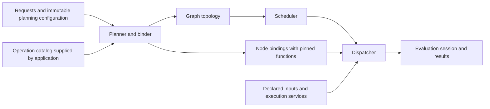

**Graph: current implementation and portfolio pricing direction**

Checked against the source on 2026-09-10, including Graph changes through
`0de50ad3`. This is the canonical Graph guide. It consolidates the previous
incremental-evaluation and portfolio-pricing reviews. Source links below are
the implementation authority. Separating graph topology from node discovery
and execution functions, and adding a persistent evaluation session, are
documented design requirements; neither change is implemented yet.

`Library/Graph` provides a C++ dependency-DAG builder and task executor. It
supports ordinary and keyed construction, parallel execution, requested-output
pruning, and caller-managed version-based caching. The current financial
examples validate scheduling with toy values. Production curve/surface
construction, simulation, trade pricing, and portfolio aggregation still need
domain adapters and a persistent evaluation layer.

**Source map**

| File | Responsibility |
| --- | --- |
| [graph_types.h](../../Library/Graph/graph_types.h) | Dense `node_id`, type-erased `node_work`, build and execution statuses |
| [graph_builder.h](../../Library/Graph/graph_builder.h), [implementation](../../Library/Graph/graph_builder.cpp) | Register nodes, ordered edges and versions; validate and freeze topology |
| [dependency_graph.h](../../Library/Graph/dependency_graph.h) | Frozen nodes, topological order, adjacency, priorities and versions |
| [keyed_graph_builder.h](../../Library/Graph/keyed_graph_builder.h) | Recursive key resolution, memoization and iterative dependency discovery |
| [graph_executor.h](../../Library/Graph/graph_executor.h), [implementation](../../Library/Graph/graph_executor.cpp) | Persistent worker pool, scheduling, results, failures and cancellation |
| [graph_passes.h](../../Library/Graph/graph_passes.h), [implementation](../../Library/Graph/graph_passes.cpp) | Ancestor selection, consumer counts and graph pruning |
| [threaded_callback_queue.h](../../Library/Parallel/tools/threaded_callback_queue.h) | Underlying worker queue from Parallel |
| [Testing/Cxx](../../Library/Graph/Testing/Cxx) | Unit tests, synthetic benchmarks and toy market-data examples |

**Build and test**

Run the CMake helper from `Scripts/`:

```bash
cd Scripts
python3 setup.py config.build.test.ninja.clang.release --project.graph
```

For an existing configuration, omit `config` and retain its configuration
tokens. For example, the configuration used for the review is rebuilt with:

```bash
python3 setup.py build.test.ninja.clangtidy --project.graph
```

`--project.graph` configures Profiler, Parallel and Graph, in that order.
Graph directly links `Parallel::Parallel`; Parallel links Profiler when its
target exists. Graph's workers use the standard-thread callback queue even
when another Parallel backend is selected. Graph does not directly depend on
Models, Core, Memory or Vectorization.

For in-tree CMake consumers, link `Graph::Graph`. For Bazel, the public target
is `//Library/Graph:Graph`; run from the repository root:

```bash
bazel test --config=release //Library/Graph/Testing/Cxx:GraphCxxTests
```

Both builds default Graph to C++20. The Graph source requires at least C++17;
CMake currently accepts `GRAPH_CXX_STANDARD=11` and `14` even though
`std::any` and other public facilities require C++17. Prefer the validated
C++20 configuration. Installed-header packaging has an unresolved defect
described below; the in-tree build does not exercise it.

Graph testing defaults to ON and Graph benchmarks default to OFF. Add the
helper's `benchmark` token to enable benchmarks. Targets are
`benchmark_graph_graphexecutor` in CMake and
`//Library/Graph/Testing/Cxx:benchmark_graphexecutor` in Bazel. Benchmarks live
under the CMake testing subtree, so testing must also remain enabled. Common
analysis/build switches use the `GRAPH_` prefix; see
[CMake options](../PROJECT_FLAGS.md), [setup](../readme/setup.md), and
[Bazel usage](../BAZEL_USER_GUIDE.md).

**Construction and result types**

`node_work` is `std::function<std::any(const std::vector<std::any>&)>`.
`add_node(name, work)` returns a dense ID local to the builder.
`depends_on(consumer, dependency)` both orders execution and adds one input
argument. Inputs arrive in declaration order, including repeated dependency
declarations. Node names are descriptive; they are not unique cache keys.

`build(out)` validates references and rejects cycles using Kahn's algorithm.
It leaves `out` untouched on failure. It copies nodes, callables and version
stamps into the built graph, so later changes to the builder do not update
an existing graph. Captured pointers/references still refer to their external
objects: freezing topology does not freeze that external state.

This complete example shares an immutable curve handle with a pricing node.
The arithmetic is only a scheduling example:

```cpp
#include <any>
#include <iostream>
#include <memory>
#include <unordered_map>
#include <vector>

#include "graph_builder.h"
#include "graph_executor.h"

struct curve
{
    double discount_factor;
};

int main()
{
    graph::graph_builder builder;
    const auto curve_id = builder.add_node(
        "curve", [](const std::vector<std::any>&) -> std::any
        { return std::make_shared<const curve>(curve{0.95}); });
    const auto price_id = builder.add_node(
        "price", [](const std::vector<std::any>& inputs) -> std::any
        {
            const auto& c =
                std::any_cast<const std::shared_ptr<const curve>&>(inputs.at(0));
            return 100.0 * c->discount_factor;
        });
    builder.depends_on(price_id, curve_id);
    builder.with_node_version(curve_id, 1);

    std::shared_ptr<graph::dependency_graph> g;
    if (!builder.build(g).ok())
    {
        return 1;
    }
    graph::graph_executor executor(graph::graph_executor_options{2});
    std::unordered_map<graph::node_id, std::any> results;
    const auto status = executor.run_to(*g, {price_id}, results);
    if (!status.ok())
    {
        std::cerr << status.message() << '\n';
        return 1;
    }
    std::cout << std::any_cast<double>(results.at(price_id)) << '\n'; // 95
}
```

`std::any` copies its contained value when the executor gathers inputs.
Putting a `shared_ptr<const T>` inside it shares a large immutable payload;
putting a vector or curve object directly inside it copies that object for
each consumer. Result types and input arity are not checked at graph build
time. A work function returning an empty optional, a null pointer, or an
empty `std::any` is considered successful unless it throws. Domain adapters
must explicitly translate their failure contracts.

**Keyed resolution and discovery**

`keyed_graph_builder<Key>::resolve(key, resolver, out_id)` calls the resolver
once per successfully resolved key. The resolver calls `ctx.resolve()` for
each input in argument order, then supplies the node name and work callable.
A memoized dependency still records an edge in its caller. Recursive
resolution of an in-progress key returns `cycle_detected`.

`with_key_version()` stamps an already-resolved key before `build()`;
`key_version()` reads its stamp. Keys stay in the builder's map: the frozen
graph and execution caches use positional IDs. Rebuilding with a different
resolution order can change those IDs. Construction is single-threaded.

`resolve_with_discovery()` separates a provider into discovery and build
callbacks. It repeats discovery while it finds unresolved keys. **This API
currently drops edges to already-resolved dependencies.** Use ordinary
`resolve()` with complete dependency declarations for shared market objects
until the discovery defect is corrected. Discovery resolves construction
recipes; it does not execute nodes or make computed values available for
inspection during the build pass.

**Execution APIs and ownership**

| API | Scheduled nodes | Returned results and reuse |
| --- | --- | --- |
| `run(g, out)` | Every node | One entry per node; fresh evaluation every call |
| `run_to(g, sinks, out)` | Requested nodes and their ancestors | Requested outputs only; intermediate slots are released after their last scheduled consumer finishes; no persistent cache |
| `run_incremental(g, baseline, cache)` | Every node, including clean nodes | Dirty nodes execute work; clean nodes copy cached values; successful entries replace the caller's cache |
| `run_async(g, out)` | Same full-graph execution as `run()` | Returns a future; `cancel()` requests skipping nodes that have not started |

The executor owns and reuses its worker pool. Thread count 0 defaults to
hardware concurrency, clamped to at least one; 1 selects one worker. Atomic
dependency counters release successors onto a mutex-protected ready heap.
Priority is the longest path to a sink measured in nodes, computed at build
time. It is not a task-duration estimate. Equal-priority ordering is not an
API guarantee.

Each executor permits one active evaluation at a time. Distinct executors
can run concurrently when callables and external state are safe to share.
For `run_async()`, keep the executor, graph, output map and captured inputs
alive until completion. Read output only after the future is ready.
Cancellation lets running callables finish; it does not interrupt an active
calibration, kernel or simulation. GPU work must be ready for consumers when
its callable returns unless the caller explicitly manages synchronization.

Work-callable exceptions record the first observed failure and skip its
descendants; independent branches may finish. Full/targeted runs use empty
`std::any` values for failed or skipped outputs. Incremental runs remove
failed/skipped entries so a later call retries them. The API does not expose
every node's failure reason. Input/cache-copy exceptions are a separate,
uncontained failure path described below. Always inspect status: an invalid
`run_to()` sink returns failure before clearing a previous output map.

Optional start/end hooks run on worker threads around executed work;
exceptions from hooks are swallowed. Hooks must be thread-safe and must not
mutate graph state. Clean cached and skipped nodes do not invoke these hooks.
Configure hooks in the options supplied to the executor constructor; there
is no public setter on an existing executor.

**Incremental evaluation contract**

For each node, the current implementation seeds dirtiness when
`g.version(id) != baseline[id]` or the cache entry is absent, then propagates
dirtiness to all descendants. Missing baseline elements count as zero.
Version zero is the default unstamped value; it still compares unequal to a
nonzero baseline. No payload equality comparison occurs.

The supported caller workflow is:

1. Start with an empty result cache and call `run_incremental(g, {}, cache)`.
2. Record the graph versions used to compute the cache in a baseline vector.
3. For an input update, supply a graph with the changed value and version.
   Builder stamps are frozen, so publishing new stamps requires another build.
4. Reuse the cache only if IDs still identify the same computations and
   dependencies. Invalidate incompatible entries and descendants, or clear
   the cache on structural/recipe changes. Merely remapping the baseline
   does not repair stale results.
5. Evaluate with the previous baseline, then maintain the baseline together
   with the returned successful cache entries. Failed/skipped entries are
   absent and will execute on retry. The executor does not update the baseline
   for the caller; retaining an older baseline causes repeated recomputation.

A shared node executes once per run. An unchanged cached incremental request
executes no work callables, but still traverses/schedules the graph and copies
cached values. A dirty predecessor forces downstream work even when its new
output equals its previous output. Separate `run_to()` requests do not reuse
intermediate results, and there is no combined incremental-target API.

**Graph passes and memory**

`ancestor_set(g, sinks)` returns a node-sized mask of requested nodes and
their dependencies; it silently ignores invalid sinks. `consumer_counts(g,
scheduled)` counts scheduled successor edges; supply a mask sized to the
graph. `prune_to_sinks()` creates a new graph and an `old_to_new` ID map,
preserving input order and versions while recomputing priorities. Dropped
nodes map to `graph_passes::npos`. An invalid sink yields `nullptr` and an
empty remapping.

Both per-node adjacency vectors and packed CSR arrays remain allocated.
`run_to()` releases intermediate result slots, but still allocates graph-sized
state and consumer counters. Full/incremental runs retain all successful
results. Neither pruning nor liveness supplies a persistent-cache retention
policy or a bound on large payload memory.

**Open defects and limitations**

These remain present in the checked source. P1 means high priority for the
intended pricing framework; documented gaps are distinguished from defects.

| Priority / kind | Evidence and consequence | Required change |
| --- | --- | --- |
| P1 defect: shared discovery | [Discovery filtering](../../Library/Graph/keyed_graph_builder.h#L264) gave two consumers dependency counts 1 and 0 in a probe; the second failed on its missing input. | Record complete ordered ports independently of node construction. Track per-consumer discovery progress without duplicating ports across passes. |
| P1 defect: worker exception containment | [Input gathering](../../Library/Graph/graph_executor.cpp#L423) and [clean-cache copying](../../Library/Graph/graph_executor.cpp#L402) are outside the work catch block. Throwing-copy probes reached `std::terminate`. | Contain preparation/materialization failures and guarantee terminal scheduler accounting; define allocation-failure behavior. |
| P1 integration hazard: cache identity | [Dirty seeding](../../Library/Graph/graph_executor.cpp#L259) checks stamps and presence only. With the same IDs/stamps but a changed dependency, a probe returned incremental 10 versus full 20, with incremental success. | Own results with semantic identity, recipe/context identity and consumed dependency revisions, or explicitly invalidate incompatible caches. |
| P1 framework gap: persistent targeted evaluation | Two `run_to()` trade requests recomputed an unchanged shared curve twice. Concurrent runs on one executor are unsupported. | A session combining target selection, persistent reuse and shared in-flight computations. |
| P2 behavior: payload copies | Four consumers produced four copies of a vector-bearing payload; one unchanged cached payload was copied again. | Immutable shared result handles; measure copied bytes and live memory. |
| P2 behavior: conservative invalidation | A quote change with an exactly unchanged intermediate output still recomputed the price. | Distinguish validation from output change if strict unchanged-output reuse is required. |
| P2 packaging defect | [Header installation](../../Library/Graph/CMakeLists.txt#L177) flattens `common/graph_export.h`. A consumer of that reproduced layout failed compilation. | Preserve header directories and test an installed consumer with dependencies. |
| P2 scale boundary | [CSR packing](../../Library/Graph/graph_builder.cpp#L124) narrows IDs and offsets to 32 bits without checking node/total-edge bounds. | Validate representable sizes before packing; no multi-billion-edge reproduction was attempted. |
| Build compatibility | CMake accepts C++11/14 despite public C++17 facilities. | Align accepted language modes with supported source. |

The current benchmarks exercise small integer DAGs. They do not establish
large-portfolio throughput, bounded simulation memory, or calibration cost
scaling. The global ready mutex, heap operations, wake-all on completion,
graph-wide cache handling and duplicate adjacency merit measurement on real
workloads before scheduler changes.

**Portfolio pricing direction — proposed, not implemented**

| Stage | Current evidence | Needed integration |
| --- | --- | --- |
| Market inputs | Generic source nodes and frozen stamps | Immutable snapshots, quote/fixing/date/convention identities and scenario overlays |
| Curves | Toy discount-factor values in [TestGraphMarketData.cpp](../../Library/Graph/Testing/Cxx/TestGraphMarketData.cpp) | Construction specifications, instruments, conventions, diagnostics and immutable curve handles |
| Volatility | Smile routines in [Models](../../Library/Models/README.md) | Surface organization, quote conventions, curve/forward dependencies and interpolation/extrapolation policies |
| Calibration | [ZABR calibrator](../../Library/Models/calibration/zabr_calibrator.h) and [QA calibrator](../../Library/Models/calibration/qa_calibrator.h) | Declare all smile/model/settings/network-revision inputs and propagate quality, convergence and fallback diagnostics |
| Simulation | Generic callable execution | Models/processes, time grids, deterministic streams, path batches, device completion and memory limits |
| Trade pricing | Toy pricing-engine/NPV data flow | Trade definitions, quantities, settings, measure selection, typed results and valuation context |
| Aggregation | A toy `portfolio_npv` node | Trade-result reductions, currencies, position multiplicity, book/netting hierarchy and complete/partial-result policy |

**Separate topology, discovery and execution — design requirement**

The graph should describe node identities, input connections and execution
constraints. Financial functions should describe their dependencies and
perform their computations independently of that graph. A planner connects
these parts; a binding table associates each node with the chosen operation.
This allows a curve constructor or calibrator to be called and tested directly,
and allows topology to be inspected, validated and pruned without constructing
or running numerical functions.

The current code already separates construction time from execution time,
but its ownership and interfaces still couple these responsibilities:

| Current coupling | Source evidence | Planned boundary |
| --- | --- | --- |
| Adding a node requires its executable work | [graph_builder::add_node](../../Library/Graph/graph_builder.h#L49) takes `node_work`. | Topology construction accepts structural descriptors; executable bindings are supplied separately. |
| Frozen topology owns callables | [dependency_graph::node](../../Library/Graph/dependency_graph.h#L59) contains `work_` alongside edges. | A graph node holds structural data; an operation catalog owns functions and bindings retain the selected implementations. |
| A resolver discovers edges and creates work | [resolver_fn](../../Library/Graph/keyed_graph_builder.h#L78) receives the builder and produces `node_work`. | Discovery returns a dependency description; only the planner records edges and selects bindings. |
| Discovery observes global construction state | [discover_fn](../../Library/Graph/keyed_graph_builder.h#L201) receives the keyed builder and may use `is_resolved()`. | Discovery uses immutable specifications/configuration and declares complete dependencies regardless of graph/cache availability. |
| The scheduler directly calls graph-owned work | [execute_node](../../Library/Graph/graph_executor.cpp#L429) invokes `g.node_at(id).work_(inputs)`. | The scheduler dispatches a ready node through its validated binding; invocation and result adaptation have a separate boundary. |

The existing `build_fn` constructs a callable; it does not perform the node's
numerical computation. Splitting `discover_fn` from `build_fn` is a useful
first step, but does not establish the required graph/function separation.
The market-data test's `resolve_market_node_with()` also combines a key switch,
dependency selection and inline numerical lambdas. Future examples should show
these as independently testable domain functions connected by an adapter.

**Proposed responsibilities and dependency direction**

| Owner | Proposed responsibility |
| --- | --- |
| Graph topology | Node IDs, optional opaque semantic keys/labels, edges indexed by consumer input port, and derived topological/CSR/priority data; contains no discovery/execution functions, market values, caches or financial types |
| Operation catalog | Explicit registration of operation identity/revision, discovery and execution functions, input/result schemas and optional equality policy; domain registrations are supplied by the application |
| Planner and binder | Resolve requests using discovery descriptions, record every input edge, detect cycles, check schemas and create a complete immutable topology plus bindings |
| Node binding | Map a positional node ID to its semantic computation identity, pinned operation definition, immutable specification and validity revisions; owns no cached numerical result |
| Execution plan | Keep one topology and its compatible binding table together for a run; retain the selected operation definitions and configuration for their required lifetimes |
| Evaluation context | Valuation date, immutable market snapshot, scenario, pricing settings and random-stream specification |
| Evaluation session | Results with validity metadata, dependency/output revisions, context-safe publication and in-flight computation sharing |
| Scheduler and dispatcher | Scheduler selects dependency-ready nodes; dispatcher obtains the pinned binding, adapts inputs, calls the function and returns a terminal outcome |
| Domain functions and adapters | Discover dependencies and compute curves, surfaces, calibrated models, path batches, trade measures and aggregates using domain inputs; adapters register them without adding domain dependencies to the graph core |

This diagram shows the proposed planning/execution flow, not the financial
dependency DAG:



Graph core interfaces must not include Models, curve, surface or trade headers.
Domain adapters depend on generic graph/planning contracts and domain
libraries; the application assembles their registrations. One operation
definition can serve many nodes with different immutable specifications.
A discovery function and an execution function may be ordinary functions or
functors; this plan does not require domain classes to inherit from a graph
node or introduce a global singleton registry.

**Proposed discovery and execution contracts**

The following is pseudocode for responsibilities, not an existing C++ API or
a commitment to particular class names:

```text
discover(node_request, planning_view)
    -> outcome<dependency_description>

dependency_description:
    complete ordered input ports: (port_id, dependency_request, expected_type)
    revisions of configuration/metadata that determined this description

execute(immutable_node_specification, declared_input_view, execution_services)
    -> outcome<immutable_result>
```

The request identifies a semantic computation, its operation and its immutable
specification. The catalog supplies compatible discovery/execution functions
and schemas. The planner interprets discovery results and writes the graph;
discovery functions receive no graph builder, node IDs, scheduler or mutable
cache. For a fixed request and planning configuration they must give a
deterministic description, including stable input ordering. They may inspect
declared configuration and metadata but must not perform calibration, generate
paths or price trades as an incidental part of dependency discovery.

Every consumer declares all its inputs even when other requests have already
resolved or cached them. The planner deduplicates producer nodes by semantic
identity while retaining every consumer port. If two ports intentionally use
the same producer, both ports remain; if discovery repeats the same port over
several passes, it is recorded once. Conflicting declarations for a port or
semantic key fail planning instead of silently adopting the first result.
This directly addresses the current shared-discovery defect.

Execution functions receive their immutable specifications and declared input
values/handles. They neither traverse the graph nor discover/add dependencies,
recursively invoke the graph executor, or fetch arbitrary mutable market data.
Underlying numerical routines remain callable directly. Generic execution
services may provide cancellation, scratch allocation or a device/stream;
any service or setting that can change numerical results must also be
represented in the computation identity or declared inputs. Source operations
read their bound keys from the requested immutable snapshot, with source
revisions tracked by the session.

Validate required ports, input types, result schema, operation availability
and binding coverage before admitting execution. Start with the existing
one-result-per-node model; multiple output ports are not necessary for this
separation. Dispatch must contain failures from input adaptation, function
invocation and result publication, and report completion exactly once even
on failure. Domain failure outcomes must not be treated as successful empty
payloads. These guarantees require future implementation; the current
payload-copy exception defect remains open.

If discovery genuinely needs metadata unavailable in its planning view, use
an explicit staged planning protocol: report the missing planning requirements,
resolve them, then produce the complete dependency description. If producing
that metadata requires computation, evaluate it as an explicit preliminary
stage and pin its result/revision before building the next plan. Being
“resolved” is not evidence that a node has an evaluated result. Never mutate
a running plan or hide numerical work inside a discovery callback to bypass
this boundary. Configuration changes that affect dependencies require
replanning; quote-value changes with unchanged structure require evaluation
in a new snapshot, not routine rediscovery.

**Bindings, revisions and function replacement**

An operation definition groups compatible discovery/execution functions and
their schemas. A node binding pins the exact definition and immutable
specification chosen during planning. Keep specification identity, discovery
revision, execution implementation revision and result/equality schema
revisions explicit where they can independently change behavior. They are
logical revisions, not function addresses, `std::function` identity, captured
pointer addresses or cache-presence flags.

Changing an execution implementation while preserving its dependency and
schema contracts can reuse topology and its analyses, but requires a new
binding/plan revision and invalidation of affected cached results. A changed
discovery implementation or structural specification requires rediscovery
and validation before any topology reuse. Reusing topology is an optimization
after checking compatibility, not permission to reuse numerical results.
An equality-policy change must not silently reuse validity decisions made
under an incompatible policy.

The catalog is frozen or snapshotted for a plan. Later registration/replacement
cannot change the callable used by an in-flight run. A plan retains required
function/configuration ownership; no node holds a dangling reference to a
temporary registration object. Reusing a function in several concurrent nodes
requires a stateless/thread-safe implementation or explicit per-invocation
workspace. This is not provided merely by making the binding table const.

**Applying the separation to financial nodes**

Names below illustrate proposed domain functions, not APIs already available
in `Library/Graph`:

| Operation | Discovery describes | Execution receives and produces |
| --- | --- | --- |
| Curve construction | Quote sets, reference curves, conventions and valuation inputs required by the curve specification | `construct_curve(spec, inputs)` returns an immutable curve and construction diagnostics |
| Volatility construction | Volatility quotes, forwards/curves and conventions selected by the surface specification | `construct_surface(spec, inputs)` returns a surface and validation diagnostics |
| Calibration | Smile/surface, curves/forwards, fixed model parameters and calibration settings | `calibrate_model(spec, inputs)` invokes a domain calibrator and returns parameters plus quality/failure information |
| Simulation batch | Calibrated process state, time grid and random-stream/path-range specification | `simulate_batch(spec, inputs)` returns one immutable path batch and completion metadata |
| Trade measures | Trade definition, pricing settings and required curves/surfaces/models or path batches | `price_trade(spec, inputs)` returns typed measures with currency and valuation context |
| Portfolio aggregation | Ordered position/trade-measure inputs and reporting-currency FX inputs | `aggregate_portfolio(spec, inputs)` applies quantities/membership and the measure's aggregation policy |

For example, trade A and trade B both declare a `discount_curve` port referring
to the same USD curve request. The planner creates one curve node and two
consumer edges. The curve binding selects `construct_curve`; each trade binding
selects `price_trade` with its own specification. The scheduler sees node/port
relationships. The functions see domain inputs. The session shares the curve
result when its context and revisions are compatible.

**Persistent evaluation on the separated plan — proposed**

Preserve the immutable DAG analyses and scheduling approach, while moving
function ownership into bindings. Add an evaluation session that owns
immutable results and the metadata proving their validity. A possible future
entry point is `evaluate(plan, targets, context)`; it is not a current API.
Bindings supply recipe/type information to evaluation; topology remains
independent of executable functions and result state.

For a requested result, a session should first ensure its dependencies are
current, compare their output revisions and its pinned binding against cached
metadata, and compute only when needed. After success it records the consumed
dependency revisions. If the new result is semantically unchanged, retain
the previous result/output revision so downstream work can remain cached.
Otherwise advance that revision. Always record the dependency revisions used,
including when output stays unchanged.

Equality must cover everything consumers can observe; pointer identity or an
arbitrary floating-point tolerance is insufficient. Types without a trustworthy
equality/revision policy require conservative recomputation. Every changing
input must participate in validity; hidden reads of mutable external state
bypass the cache contract. Concurrent requests for the same recipe and input
state should share one computation. Older-snapshot work must not overwrite a
newer context's valid result.

Keep solver iterations inside meaningful calibration tasks. Solve mutually
dependent curves/models inside an explicit joint task while the outer DAG
continues rejecting cycles. For simulation, use path batches shared across
compatible trades, bound the live batches, and derive random streams from
stable path/scenario identities rather than worker order. Separate long-lived
curve/model caches from large temporary simulation payloads; eviction permits
later recomputation and therefore changes retention guarantees.

Separate shared trade analytics from position quantities and membership, so
deduplication does not collapse distinct positions. Define currency conversion,
overlapping selections and aggregation for non-additive measures. Report
success, failure, upstream blocking and cancellation explicitly; one run-level
error and empty values do not describe all independent trade failures or a
clearly labelled partial portfolio valuation.

**Implementation sequence — plan only**

1. Establish operation, discovery-description and binding contracts. Refactor
   one future example into standalone discovery and numerical functions, with
   explicit registration and direct-call tests. A compatibility adapter can
   translate complete descriptions into ordinary `resolve()` calls and bind
   execution functions to today's `node_work`. This adapter is a migration
   step; today's frozen graph would still physically own the wrapper callable.
2. Separate topology storage from bindings and validate their compatibility.
   Move builder recursion into the planner; route ready nodes through a generic
   dispatcher. Preserve existing input ordering, cycle detection, pruning,
   failure propagation and cancellation behavior. Add regressions for shared
   ports, repeated discovery, invalid bindings and throwing payload copies;
   repair installation and exception containment before production integration.
3. Introduce persistent targeted evaluation with binding-aware cache provenance
   and snapshot isolation. Add typed domain inputs/results and complete failure
   states. Explicitly invalidate legacy caches when computation identity changes.
4. Build a real slice: quotes → curve/smile construction → an existing Models
   calibrator → two trades sharing market/model objects → a currency-aware
   portfolio aggregate. Compare with direct calls to the same domain routines.
5. Add reproducible simulation batches, reductions and resource limits.

These are future implementation tasks. The documentation update introduces no
new graph APIs, callable registry, planner or runtime behavior.

**Acceptance cases for separation and evaluation**

| Acceptance case | Intended outcome for the proposed design |
| --- | --- |
| Topology built with structural descriptors only | Validation/pruning require no executable function or domain library |
| Discovery called directly with fixed configuration | Returns the same complete ordered ports with no graph/executor/cache dependency |
| Numerical function called directly | Matches graph-dispatched results for the same declared inputs/specification |
| Two consumers declare an existing shared dependency | One producer node and all consumer input ports remain present |
| Repeated discovery or repeated producer arguments | Repeated declarations of one port do not duplicate it; distinct ports can share a producer |
| Missing operation, incompatible schema or incomplete binding table | Planning/binding fails before any numerical work starts |
| Execution function replaced with compatible ports | Topology can be reused with a new binding revision; incompatible cached results are invalidated |
| Discovery or dependency-selecting configuration changes | Replan and validate all affected port/binding relationships |
| Catalog changes during an in-flight run | That run retains its pinned functions and configuration |
| Dependency needed only after metadata computation | Explicit staged planning pins that metadata; no mutation of the running topology |
| First request | Compute each required node once |
| Repeated unchanged request | No cached work callable executes again |
| Sequential/concurrent trades sharing unchanged inputs | Reuse completed results or share one in-flight computation |
| Unrelated quote update | Preserve unaffected requested branches |
| Relevant quote update with changed output | Recompute affected requested consumers |
| Relevant update with identical intermediate output | Retain downstream results under the explicit equality policy |
| Same-value source update | Preserve its output revision under that policy |
| Changed recipe, dependency order, trade settings or IDs | Invalidate incompatible cached results |
| Failure after a previous success | Report failure without presenting the old value as current; retry failed work |
| Overlapping older/newer snapshots | Publish results only into compatible context state |
| Simulation across thread counts | Preserve stream assignment and the defined reduction/reproducibility contract |
| Large portfolios and simulation | Measure cold/warm/bump latency, work executions, scheduled nodes, copied bytes and retained memory |

**Validation record**

On 2026-09-10, `python3 setup.py build.test.ninja.clangtidy --project.graph`
passed in the existing macOS arm64 Release/C++20 configuration. All four
configured CTest entries passed: Profiler, Parallel, the Parallel benchmark
and Graph. Graph reported 41 tests across five suites. This build reused
unchanged Graph objects; it did not force a fresh clang-tidy run on them.
No new sanitizer or Bazel run accompanied that review.

The defect/behavior observations above came from temporary executable probes
and an installed-layout compilation probe during the same review. They are
review evidence, not committed regression tests. The existing Graph tests
cover builders, ordinary keyed sharing, execution order, work exceptions,
cancellation, pruning, cache misses, version propagation and failed-cache
retry. They do not establish the proposed session guarantees or numerical
validity of a complete financial pipeline.

Liveness tests check reference ownership after return, which alone does not
establish early reclamation or peak-memory bounds. On macOS with ASan,
[GraphTestMain.cpp](../../Library/Graph/Testing/Cxx/GraphTestMain.cpp) calls
`_Exit()` after assertions to bypass a documented third-party teardown issue;
normal process teardown is therefore skipped in that configuration.
